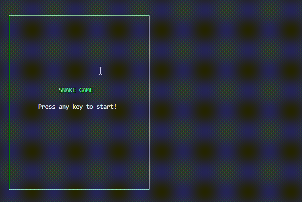

# Snakify <!-- omit in toc -->

A classic Snake game implemented in **Python** and played via cli.

[](https://pypi.org/project/snakify/)
[](https://pypi.org/project/snakify/)
[](LICENSE)
[](https://github.com/bhatishan2003/snakify/actions/workflows/python-app.yml)
[](https://codecov.io/gh/bhatishan2003/snakify)

## Table of Contents <!-- omit in toc -->

- [Installation](#installation)
- [Usage](#usage)
- [Development Notes](#development-notes)

---

## Installation

-   From PyPi

    ```bash
    pip install snakify
    ```

-   From Source :

    ```bash
    git clone https://github.com/bhatishan2003/snakify.git
    cd snakify
    pip install .
    ```

## Usage

Run the following command in the terminal to play the game.

```bash
snakify
```



## Development Notes

-   For development (editable mode), do following installation:

    -   Core only:

        ```bash
        pip install -e .
        ```

    -   With tests:
        ```bash
        pip install -e .[test]
        ```
    -   With dev tools:

        ```bash
        pip install -e .[dev]
        ```

    -   All dependencies (test + dev):
        ```bash
        pip install -e .[all]
        ```

-   Pre-commit

    We use pre-commit to automate linting of our codebase.

    -   Install hooks:
        ```bash
        pre-commit install
        ```
    -   Run Hooks manually (optional):
        ```bash
        pre-commit run --all-files
        ```

-   Ruff:

    -   Lint and format:
        ```bash
        ruff check --fix
        ruff format
        ```
